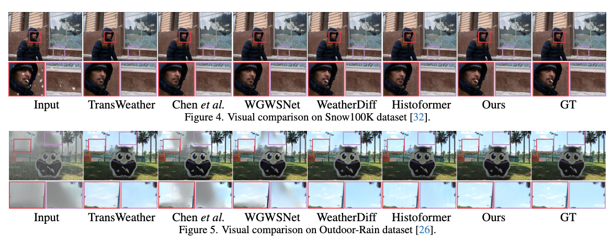
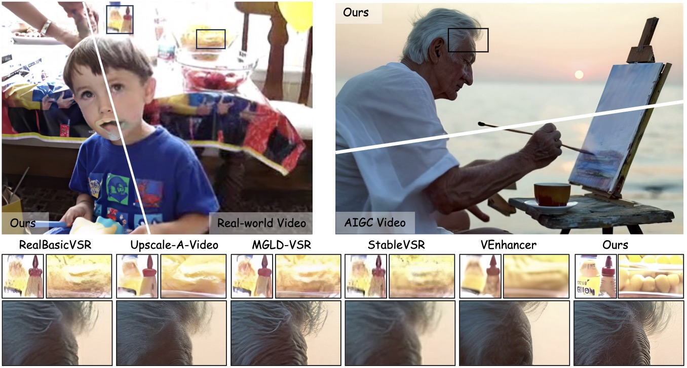
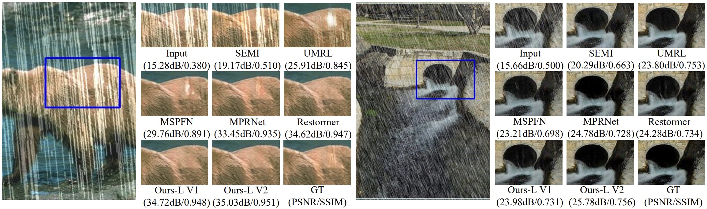
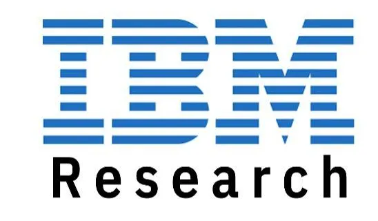
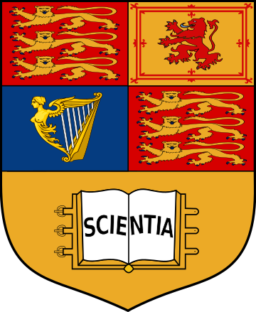
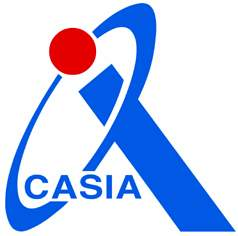
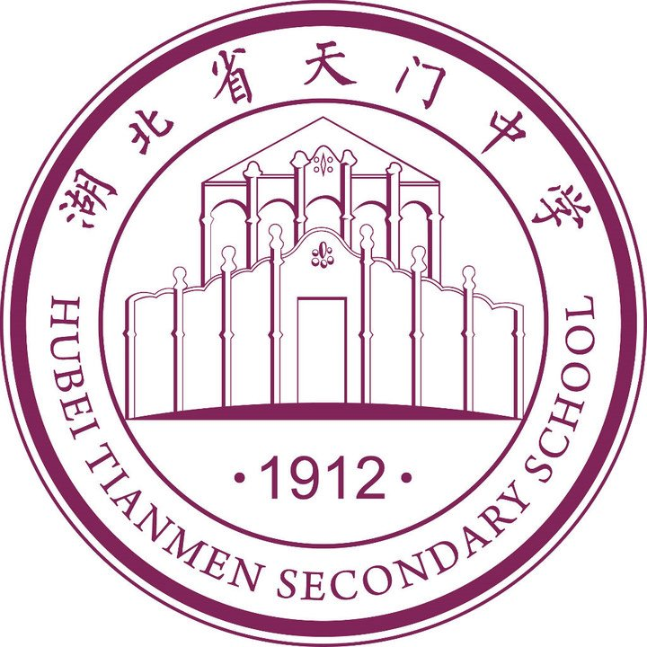








 I am now an Associate Professor with the Hong Kong University of Science and Technology (HKUST). Previously, I worked as an Associate Professor at <a href="https://en.wikipedia.org/wiki/Sun_Yat-sen_University" target="_blank">Sun Yat-sen University</a>, and an applied research scientist at <a href="https://en.wikipedia.org/wiki/Tencent" target="_blank">Tencent</a>, solving real-world problems using computer vision and machine learning techniques. Prior to Tencent, I worked for Amazon in Palo Alto, California, where I developed deep models for better visual search experience. Before that, I worked as a research scientist in Tencent AI Lab. The techniques I have developed/involved have been shipped to several products in Tencent such as WeChat, QQ, Tencent Video, Tencent Yuanbao, Tencent Cloud, and myapp. I received the Ph.D. degree from <a href="https://www.imperial.ac.uk/" target="_blank">Imperial College London</a>, UK, 2016, under the supervision of <a href="https://sites.google.com/view/tkkim/" target="_blank">Prof. Tae-Kyun Kim</a>, and working closely with <a href="https://bjornstenger.github.io/" target="_blank">Dr. Bjorn Stenger</a>, M.E. degree from <a href="http://english.ia.cas.cn/" target="_blank">Institute of Automation</a>, Chinese Academy of Sciences, China, 2012, under the supervision of <a href="https://scholar.google.com/citations?user=Wl4tl4QAAAAJ&hl=en" target="_blank">Prof. Weiming Hu</a>, and B.E. degree from <a href="https://en.wikipedia.org/wiki/Huazhong_University_of_Science_and_Technology" target="_blank">Huazhong University of Science and Technology</a>, China, 2009.

 I have published over 100 peer-reviewed papers in top-tier conferences and journals, like ICML, NeurIPS, CVPR, ICCV, ECCV, SIGGRAPH, AAAI, ACL, ACMMM, ICLR, TPAMI, AI, IJCV. My work is selected into the CVPR 2019 Best Paper Finalist and I was awarded the 2022 ACM China Rising Star Award (Guangzhou Chapter). I have served as Senior Area Editor for IEEE Signal Processing Letters, Associate Editor for IEEE Transactions on Image Processing, Neurocomputing, IET Computer Vision, Guest Editor for CVIU, Area Chair for NeurIPS 2025, ACM MM 2025, ICML 2025, IJCAI 2025, IJCNN 2025, BMVC 2024/2025, and Senior Program Committee member for AAAI and IJCAI, regular reviewer for top conferences and journals like TPAMI, IJCV, CVPR, ICML, ICCV. I have been elected among Top 2% Scientists worldwide (2023 & 2024) by Stanford/Elsevier.

[<a href="assets/WenhanLuo_CV.pdf" target="_blank">Curriculum Vitae</a>] [<a href="https://facultyprofiles.hkust.edu.hk/profiles.php?profile=wenhan-luo-whluo" target="_blank">HKUST Profile</a>] 

Multiple PHD opennings in efficient large model, AIGC (image and video generation), content restoration and enhancement are available. Please check the Join Us page for details.

# Research

 I conduct research on creative AI. Specifically, my current research focuses on several topics, such as image/video generation and restoration/enhancement. My research is supported by the following sponsors. 

 

# Updates
- 2025/06: &nbsp; I will serve as Senior Area Editor (S-AE) for IEEE Signal Processing Letters.
- 2025/06: &nbsp; MaterialMVP and MOERL are accepted by ICCV 2025.
- 2025/06: &nbsp; Our group secured funding from Tencent ([news](https://amc.hkust.edu.hk/news/research-project-selected-2025-tencent-ai-lab-rhino-bird)), ByteDance, Huawei, Wiener Intelligence, Video Rebirth, Qingdao Municipal Bureau of Science and Technology.
- 2025/06: &nbsp; Paper to appear in TKDE.
- 2025/05: &nbsp; Papers accepted by TVCG and ACL 2025.
- 2025/05: &nbsp; Serve as Area Chair for BMVC 2025.
- 2025/04: &nbsp; Two papers are accepted by SIGGRAPH 2025.
- 2025/04: &nbsp; Serve as COI Coordinator for SIGGRAPH Asia 2025.
- 2025/04: &nbsp; I will serve as Area Chair for NeurIPS 2025.
- 2025/03: &nbsp; Content restoration works to appear in TPAMI and PR.
- 2025/03: &nbsp; I serve as Workshop Chair for [CVM 2025](http://iccvm.org/2025/).
- 2025/03: &nbsp; I will serve as Area Chair for ACM Multimedia 2025.
- 2025/02: &nbsp; Three papers accepted by CVPR 2025.

<a onclick="toggleList()" id='more'>Show more</a>

  
  - 2025/01: &nbsp; I will serve as Associate Editor for IEEE Transactions on Image Processing.
  - 2025/01: &nbsp; Two papers accepted by ICLR 2025.
  - 2025/01: &nbsp; Uni-MoE accepted by TPAMI.
  - 2024/12: &nbsp; Invited to serve as Area Chair for IJCAI 2025.
  - 2024/12: &nbsp; Invited to serve as Area Chair for ICML 2025.
  - ~~2024/11: &nbsp; Invited to serve as Senior Program Committe member (SPC) for IJCAI 2025.~~
  - 2024/10: &nbsp; Awarded the CCF-Tencent Rhino-Bird Faculty Fund Excellence Award, see the [news](https://mp.weixin.qq.com/s/90ajLg_GxG5dsap7s4qasw).
  - 2024/09: &nbsp; Two Papers accepted by NeurIPS 2024.
  - 2024/09: &nbsp; Elected among Stanford/Elsevier Top 2% Scientists List 2024.
  - 2024/09: &nbsp; Paper to appear in TKDE. 
  - 2024/09: &nbsp; Paper to appear in IJCV.
  - 2024/08: &nbsp; Paper to appear in TCSVT.
  - 2024/07: &nbsp; Paper accepted by ACM MM 2024.
  - 2024/07: &nbsp; Four papers accepted by ECCV 2024.
  - 2024/06: &nbsp; Invited to serve as Senior Program Committe member (SPC) for AAAI 2025.
  - 2024/05: &nbsp; Invited to serve as Area Chair for BMVC 2024.
  - 2024/05: &nbsp; Paper accepted by ICML 2024.
  - 2024/04: &nbsp; Our team win two championship awards in the two tracks of [NTIRE 2024](https://cvlai.net/ntire/2024/) challenges (Bracketing Image Restoration and Enhancement Challenge - Track 1 & 2) in conjunction with CVPR2024, see the [award](https://cvlai.net/ntire/2024/NTIRE2024awards_certificates.pdf).
  - 2024/04: &nbsp; Paper to appear in IEEE TGRS.
  - 2024/03: &nbsp; Together with Samsung, we win the 2rd place in the competition of Few-shot RAW Image Denoising @ [MIPI2024](https://mipi-challenge.org/MIPI2024/) in conjunction with CVPR2024, see the [award](https://mipi-challenge.org/MIPI2024/award_certificates_2024.pdf).
  - 2024/03: &nbsp; Paper to appear in TCSVT.
  - 2024/03: &nbsp; Paper to appear in IJCV.
  - 2024/02: &nbsp; Two papers accepted by CVPR 2024.
  - 2024/02: &nbsp; Paper accepted by COLING 2024 (multi-modal in-context learning).
  - 2024/02: &nbsp; I will be joining the Hong Kong University of Science and Technology (HKUST) as Associate Professor in 2024 spring/summer.
  - 2024/01: &nbsp; Paper accepted by ICLR 2024.
  - 2023/12: &nbsp; Paper to appear in TNNLS (blind face restoration).
  - 2023/12: &nbsp; Invited to serve as Senior Program Committe member (SPC) for IJCAI 2024.
  - 2023/11: &nbsp; Paper to appear in TCSVT (under-display camera face image restoration).
  - 2023/10: &nbsp; Elected among Top 2% Scientists worldwide 2023 by Stanford University.
  - 2023/09: &nbsp; Paper accepted by NeurIPS 2023 (punctuation-level attacks fooling text models).
  - 2023/09: &nbsp; Paper to appear in TCSVT (image deblurring benchmark).
  - 2023/09: &nbsp; Paper to appear in Pattern Recognition (image dehazing).
  - 2023/07: &nbsp; I was granted the CCF-Tencent Rhino-Bird Faculty Research Fund, see the [news](https://www.ccf.org.cn/Collaboration/Enterprise_Fund/News/tx/2023-07-31/794523.shtml).
  - 2023/07: &nbsp; Paper to apppear in TCSVT (all-in-one weather-degraded image restoration).
  - 2023/07:&nbsp; Four papers accepted by ICCV 2023.
  - 2023/07:&nbsp; Invited to serve as a member of Senior Program Committe (SPC) for AAAI 2024.
  - 2023/06:&nbsp; Paper accepted by IROS 2023 (hand interaction tracking).
  - 2023/02:&nbsp; Paper accepted by CVPR 2023 (reflection removal against adversarial attacks).
  - 2023/02:&nbsp; Elevation to IEEE Senior Member.
  - 2023/01:&nbsp; Paper accepted by TNNLS (presentation attack detection).
  - 2022/12:&nbsp; Invited to serve as a member of Senior Program Committe (SPC) for IJCAI 2023.
  - 2022/11:&nbsp; Paper accepted by AAAI2023 (low-light image enhancement).
  - 2022/11:&nbsp; TMM paper accepted (multi-modal retrieval).
  - 2022/10:&nbsp; TMM paper accepted (image dehazing).
  - 2022/09:&nbsp; Awarded the 2022 ACM China Rising Star Award (Guangzhou Chapter), see the [news](https://www.scholat.com/vpost.html?pid=199904).
  - 2022/08:&nbsp; Paper accepted by WACV2023 (few-shot object counting).
  - 2022/07:&nbsp; I joined Sun Yat-sen University as an associate professor.
  - 2022/06:&nbsp; Paper accepted by ACM MM 2022 (multi-object tracking).
  - 2022/05:&nbsp; TPAMI paper accepted (face hallucination).
  - 2022/05:&nbsp; Paper accepted by IJCV (image deblurring survey).
  - 2022/04:&nbsp; Paper accepted by IJCV (image deraining).
  - 2022/03:&nbsp; Paper accepted by CVPR2022 (aesthetic text logo synthesis).
  - 2022/01:&nbsp; TPAMI paper accepted (video deraining).
  - 2021/09:&nbsp; TIP paper accepted (image deraining).
  - 2021/08:&nbsp; Invited to serve as a Senior PC member for AAAI 2022.
  - 2021/08:&nbsp; TIP paper accepted (image desnow).
  - 2021/07:&nbsp; Paper accepted by ICCV2021 (image SR benchmarking).
  - 2021/07:&nbsp; One paper (image deblur & SR) to appear in IEEE Transactions on Image Processing.
  - 2021/06:&nbsp; TMM paper accepted (action recognition).
  - 2021/05:&nbsp; Our work of active visual tracking is accepted by ICML2021.
  - 2021/05:&nbsp; One paper of image dehazing to appear in IEEE Transactions on Image Processing.
  - 2021/04:&nbsp; Our work of human image synthesis is accepted to appear in TPAMI.
  - 2021/03:&nbsp; One paper to appear in IEEE Transactions on Geoscience and Remote Sensing.
  - 2021/02:&nbsp; One paper to appear in IEEE Transactions on Multimedia.
  - 2020/12:&nbsp; The paper "Multiple Object Tracking: A Literature Review" is accepted by Artificial Intelligence.
  - 2020/12:&nbsp; Invited to serve as a Senior PC member for IJCAI 2021.
  - 2020/11:&nbsp; One paper of pedestrian detection to appear in IEEE Transactions on Image Processing.
  - 2020/09:&nbsp; An invited talk is given in SUSTech, hosted by [Prof. Xiaoying Tang](https://eee.sustc.edu.cn/?view=%E5%94%90%E6%99%93%E9%A2%96&jsid=18&lang=en).
  - 2020/09:&nbsp; One paper of optical flow estimation to appear in IEEE Transactions on Image Processing.
  - 2020/07:&nbsp; One paper to appear in ACM MM 2020 (Oral).
  - 2020/07:&nbsp; One paper to appear in ECCV2020.
  - 2020/06:&nbsp; One paper of multiple object tracking to appear in Pattern Recognition.
  - 2020/05:&nbsp; We are organizing a special issue of action recognition and detection on CVIU. Submission deadline is Sep 15th. See the [CFP](https://www.journals.elsevier.com/computer-vision-and-image-understanding/call-for-papers/modeling-methodology-and-applications-of-action-recognition) if interested
  - 2020/02:&nbsp; Two papers (one oral + one poster) to appear in CVPR2020.
  - 2019/10:&nbsp; One paper to appear in TPAMI, entitled "AD-VAT+: An Asymmetric Dueling Mechanism for Learning and Understanding Visual Active Tracking".
  - 2019/09:&nbsp; Code and dataset of our ICCV2019 paper for motion imitation, appearance transfer and novel view synthesis are released. Check the project page [here](https://svip-lab.github.io/project/impersonator).
  - 2019/09:&nbsp; One paper to appear in IJCV.
  - 2019/07:&nbsp; One paper to appear in ICCV2019.
  - 2019/07:&nbsp; The code of our ACL2019 paper is released. Check it [here](https://github.com/zfchenUnique/WSSTG).
  - 2019/07:&nbsp; The code of our ICLR2019 paper is released. Check it [here](https://github.com/zfw1226/active_tracking_rl).
  - 2019/05:&nbsp; Join Amazon in California as a research scientist.
  - 2019/06:&nbsp; Our CVPR paper entitled "Learning to Compose Dynamic Tree Structures for Visual Context" is selected as one of the best paper finalists (50 out of the 1294 accepted papers in CVPR2019).
  - 2019/05:&nbsp; One paper of video grounding to appear in ACL2019 as a long paper, and oral presentation.
  - 2019/05:&nbsp; Serve as program committee member of the workshop of [Vision Meets Drones 2019: A Challenge](http://aiskyeye.com/) in conjunction with ICCV2019.
  - 2019/03:&nbsp; Four papers (2 orals + 2 posters) to appear in CVPR2019.
  - 2019/02:&nbsp; Serve as program committee member of the [4th BMTT MOT Challenge Workshop](https://motchallenge.net/workshops/bmtt2019/index.html) and the [2nd Workshop and Challenge on Target Re-identification and Multi-Target Multi-Camera Tracking](https://reid-mct.github.io/2019/) in conjunction with CVPR2019.
  - 2019/02:&nbsp; The code of our CVPR 2018 paper is released. Check it here.
  - 2019/01:&nbsp; Our work of "[End-to-end Active Object Tracking and Its Real-world Deployment via Reinforcement Learning](https://arxiv.org/abs/1808.03405)" is accepted by TPAMI.
  - 2018/12:&nbsp; One paper to appear in ICLR2019. Congratulations to Fangwei Zhong.
  - 2018/11:&nbsp; One paper to appear in [NIPS2018 workshop on Deep Reinforcement Learning](https://sites.google.com/view/deep-rl-workshop-nips-2018/home).
  - 2018/11:&nbsp; One paper to appear in AAAI2019. Congratulations to Kaihao Zhang.
  - 2018/10:&nbsp; Welcome Tianrui Liu (Imperial College London) on board as a research intern.
  - 2018/09:&nbsp; The code of our ICML2018 paper is released. Check it [here](https://sites.google.com/site/whluoimperial/active_tracking_icml2018).
  - 2018/09:&nbsp; The code of our ECCV2018 paper "Bi-Real Net" is released. Check it [here](https://github.com/liuzechun/Bi-Real-net).
  - 2018/08:&nbsp; Our work of video deblur is accepted by IEEE Transactions on Image Processing. Congratulations to Kaihao Zhang.
  - 2018/08:&nbsp; One paper of multiple object tracking is accepted by IEEE Transactions on Image Processing.
  - 2018/07:&nbsp; The dataset for our CVPR2018 paper, Sky Scene is released. See our [project page](https://sites.google.com/site/whluoimperial/mdgan) for details.
  - 2018/07:&nbsp; One paper to appear in ECCV2018. Congratulations to Zechun Liu.
  - 2018/05:&nbsp; Our work of End-to-end Active Object Tracking via Reinforcement Learning is accepted by ICML2018. The camera-ready version will come soon.
  - 2018/05:&nbsp; Serve as a member of the advisory committee of the workshop of [Vision Meets Drone: A Challenge](http://aiskyeye.com/) (VisDrone2018, for short) in conjunction with ECCV2018.
  - 2018/04:&nbsp; Welcome Jia Wan (NWPU) on board as an intern.
  - 2018/02:&nbsp; One paper to appear in CVPR2018. Congratulations to Wei Xiong.
  - 2018/01:&nbsp; Welcome our intern Zechun Liu (HKUST) on board.
  - 2017/10:&nbsp; Welcome Yiming Chen (Imperial College London) on board as an intern in Tencent AI Lab.
  - 2017/08:&nbsp; Welcome Kaihao Zhang on board as intern in Tencent AI Lab. Kaihao is from Australian National University and will work close with me for about six months.
  - 2017/06:&nbsp; Welcome Weiyue Su and Wei Xiong on board as intern in Tencent AI Lab. Weiyue is from South China University of Technology. Wei is from Wuhan University.
  - 2017/05:&nbsp; Serve as a program committee member of the First [Joint BMPP-PETS Workshop on Tracking and Surveillance](https://motchallenge.net/workshops/bmtt-pets2017/index.html) in conjunction with CVPR2017.
  - 2017/04:&nbsp; One paper to appear in CVPR2017.
  - 2016/07:&nbsp; Join Tencent AI Lab as a research scientist.
  - 2016/06:&nbsp; Pass viva exam and obtained the Ph.D. degree, examined by [Tao (Tony) Xiang](https://www.eecs.qmul.ac.uk/~txiang/) from Queen Mary University of London.
  - 2016/05:&nbsp; Serve as a program committee member of the workshop [Benchmarking Multi-Target Tracking: MOTChallenge](https://motchallenge.net/workshops/bmtt2016/) in conjunction with ECCV2016.
  - 2015/02:&nbsp; Start internship in Microsoft Research Asia with [Dr. David Wipf](http://www.davidwipf.com/) (from Feb 2015 to June 2015).
  
  {{ hidden_list | markdownify }}

<a onclick="toggleList()" id='less' style='display:none;'>Show less</a>

# Recent Work [**[More]**](assets/publication.html)
<table
    style="width:100%;max-width:900px;border:0px;border-spacing:0px;border-collapse:separate;margin-right:auto;margin-left:0px;">
    <tbody>
     
    <tr>
      <td style="padding-top: 10px; padding-bottom: 10px;width:35%;vertical-align:middle;text-align:center">
        
      </td>
      <td style="padding:20px;width:65%;vertical-align:middle;text-align:justify">
        <papertitle>UNIC: Unified In-Context Video Editing</papertitle>,
                   Zixuan Ye, Xuanhua He, Quande Liu, Qiulin Wang, Xintao Wang, Pengfei Wan, Di Zhang, Kun Gai, Qifeng Chen, Wenhan Luo, 
                  <i>arXiv:2506.04216.</i>
                   
                  [<a href="https://arxiv.org/abs/2506.04216" target="_blank">arXiv</a>]
                  [<a href="https://zixuan-ye.github.io/UNIC/" target="_blank">Project Page</a>]
      </td>
    </tr>

    <tr>
      <td style="padding-top: 10px; padding-bottom: 10px;width:35%;vertical-align:middle;text-align:center">
        
      </td>
      <td style="padding:20px;width:65%;vertical-align:middle;text-align:justify">
        <papertitle>Let Them Talk: Audio-Driven Multi-Person Conversational Video Generation</papertitle>,
                   Zhe Kong, Feng Gao, Yong Zhang, Zhuoliang Kang, Xiaoming Wei, Xunliang Cai, Guanying Chen, Wenhan Luo, 
                  <i>arXiv:2505.22647.</i>
                   
                  [<a href="https://arxiv.org/abs/2505.22647" target="_blank">arXiv</a>]
                  [<a href="https://meigen-ai.github.io/multi-talk/" target="_blank">Project Page</a>]
                  [<a href="https://github.com/MeiGen-AI/MultiTalk/" target="_blank">Code</a>]
                  [<a href="https://huggingface.co/MeiGen-AI/MeiGen-MultiTalk" target="_blank">Hugging Face Model</a>]
                  [<a href="https://huggingface.co/spaces/fffiloni/Meigen-MultiTalk" target="_blank">Gradio</a>]
                  
      </td>
    </tr>

    <tr>
      <td style="padding-top: 10px; padding-bottom: 10px;width:35%;vertical-align:middle;text-align:center">
        
      </td>
      <td style="padding:20px;width:65%;vertical-align:middle;text-align:justify">
        <papertitle>MaterialMVP: Illumination-Invariant Material Generation via Multi-view PBR Diffusion</papertitle>,
                   Zebin He, Mingxin Yang, Shuhui Yang, Yixuan Tang, Tao Wang, Kaihao Zhang, Guanying Chen, Yuhong Liu, Jie Jiang, Chunchao Guo, Wenhan Luo, 
                  <i>Proc. of International Conference on Computer Vision (ICCV), Hawaii, USA, 2025.</i>
                   
                  [<a href="https://arxiv.org/abs/2503.10289" target="_blank">arXiv</a>]
                  [<a href="https://zebinhe.github.io/MaterialMVP/" target="_blank">Project Page</a>]
                  [<a href="https://github.com/ZebinHe/MaterialMVP" target="_blank">Code</a>]
                  
      </td>
    </tr>

    <tr>
      <td style="padding-top: 10px; padding-bottom: 10px;width:35%;vertical-align:middle;text-align:center">
        
      </td>
      <td style="padding:20px;width:65%;vertical-align:middle;text-align:justify">
        <papertitle>MOERL: When Mixture-of-Experts Meet Reinforcement Learning for Adverse Weather Image Restoration</papertitle>,
                   Tao Wang, Peiwen Xia, Bo Li, Peng-Tao Jiang, Zhe Kong, Kaihao Zhang, Tong Lu, Wenhan Luo, 
                  <i>Proc. of International Conference on Computer Vision (ICCV), Hawaii, USA, 2025.</i>
                   
      </td>
    </tr>

    <tr>
      <td style="padding-top: 10px; padding-bottom: 10px;width:35%;vertical-align:middle;text-align:center">
        
      </td>
      <td style="padding:20px;width:65%;vertical-align:middle;text-align:justify">
        <papertitle>DAM-VSR: Disentanglement of Appearance and Motion for Video Super-Resolution</papertitle>,
                   Zhe Kong, Le Li, Yong Zhang, Feng Gao, Shaoshu Yang, Tao Wang, Kaihao Zhang, Zhuoliang Kang, Xiaoming Wei, Guanying Chen, Wenhan Luo, 
                  <i>ACM SIGGRAPH, 2025.</i>
                   
                  [<a href="" target="_blank">PDF</a>]
                  [<a href="https://kongzhecn.github.io/projects/dam-vsr/" target="_blank">Project Page</a>]
                  [<a href="https://github.com/kongzhecn/DAM-VSR" target="_blank">Code</a>]
      </td>
    </tr>

    <tr>
      <td style="padding-top: 10px; padding-bottom: 10px;width:35%;vertical-align:middle;text-align:center">
        
      </td>
      <td style="padding:20px;width:65%;vertical-align:middle;text-align:justify">
        <papertitle>MB-TaylorFormer V2: Improved Multi-branch Linear Transformer Expanded by Taylor Formula for Image Restoration</papertitle>,
                   Zhi Jin, Yuwei Qiu, Kaihao Zhang, Hongdong Li, Wenhan Luo, 
                  <i>IEEE Trans. on Pattern Analysis and Machine Intelligence (TPAMI), to appear.</i>
                   
                  [<a href="https://arxiv.org/abs/2501.04486" target="_blank">arXiv</a>]
                  [<a href="https://github.com/FVL2020/MB-TaylorFormerV2" target="_blank">Code</a>]
      </td>
    </tr>

    <tr>
      <td style="padding-top: 10px; padding-bottom: 10px;width:35%;vertical-align:middle;text-align:center">
        
      </td>
      <td style="padding:20px;width:65%;vertical-align:middle;text-align:justify">
        <papertitle>StyleMaster: Stylize Your Video with Artistic Generation and Translation</papertitle>,
                   Zixuan Ye, Huijuan Huang, Xintao Wang, Pengfei Wan, Di Zhang, Wenhan Luo, 
                  <i>Proc. of IEEE Conf. on Computer Vision and Pattern Recognition (CVPR), 2025.</i>
                   
                  [<a href="https://arxiv.org/pdf/2412.07744" target="_blank">arXiv</a>]
                  [<a href="https://github.com/KwaiVGI/StyleMaster" target="_blank">Github</a>]
                  [<a href="https://zixuan-ye.github.io/stylemaster/" target="_blank">Project Page</a>]
                  
      </td>
    </tr>

    <tr>
      <td style="padding-top: 10px; padding-bottom: 10px;width:35%;vertical-align:middle;text-align:center">
        
      </td>
      <td style="padding:20px;width:65%;vertical-align:middle;text-align:justify">
        <papertitle>Towards Multiple Character Image Animation Through Enhancing Implicit Decoupling</papertitle>,
         Jingyun Xue, Hongfa Wang, Qi Tian, Yue Ma, Andong Wang, Zhiyuan Zhao, Shaobo Min, Wenzhe Zhao, Kaihao Zhang, Heung-Yeung Shum, Wei Liu, Mengyang Liu, Wenhan Luo, 
        <i>International Conference on Learning Representations (ICLR), 2025.</i>
         
        [<a href="https://openreview.net/forum?id=aqlzXgXwWa" target="_blank">PDF</a>]
        [<a href="https://multi-animation.github.io/" target="_blank">Project Page</a>]
        [<a href="https://cloud.tencent.com/product/vclm" target="_blank">API in Tencent Cloud</a>]
      </td>
    </tr>

  </tbody>
</table>

# Experience

I have studied/interned/worked in the following affiliations.

 

                  # Views:  (Since Dec 11, 2024)
                

