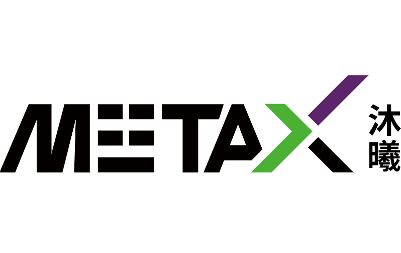
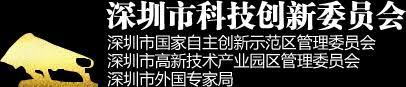








 I am now an Associate Professor at Division of Arts and Machine Creativity (AMC) and Division of Emerging Interdisciplinary Areas (EMIA) with the Hong Kong University of Science and Technology (HKUST). Previously, I worked as an Associate Professor at Sun Yat-sen University, and an applied research scientist at Tencent, solving real-world problems using computer vision and machine learning techniques. Prior to Tencent, I worked for Amazon (A9) in Palo Alto, California, where I developed deep models for better visual search experience. Before that, I worked as a research scientist in Tencent AI Lab. The techniques I have developed/involved have been shipped to several products in Tencent such as WeChat, QQ, Tencent Video, and myapp. I received the Ph.D. degree from Imperial College London, UK, 2016, M.E. degree from Institute of Automation, Chinese Academy of Sciences, China, 2012 and B.E. degree from Huazhong University of Science and Technology, China, 2009. I have published over 80 peer-reviewed papers, most of which are published in top-tier conferences and journals, like ICML, NeurIPS, CVPR, ICCV, ECCV, AAAI, ACL, ACMMM, ICLR, TPAMI, AI, IJCV, TIP. I received the CVPR 2019 Best Paper Nominee and was awarded the 2022 ACM China Rising Star Award (Guangzhou Chapter). I have been elected among Top 2% Scientists worldwide (2023 & 2024) by Stanford/Elsevier. [<a href="assets/WenhanLuo_CV.pdf" target="_blank">CV</a>] 

I am now looking fro a PhD student whose expertise is image/video restoration and enhancement. Please check the Join Us page for details.

I invite graduated PhD students from top universities in Mainland China to apply for the Hong Kong Scholars Program 2025 (香江学者计划) and work with me. Please check the Join Us page for details.

# Research

I conduct research on creative AI. Specifically, my current research focuses on several topics, such as image/video synthesis and enhancement. My research is supported by the following sponsors/agencies.

# Updates
- 2024/12: &nbsp; Invited to serve as Area Chair for ICML 2025.
- 2024/11: &nbsp; Invited to serve as Senior Program Committe member (SPC) for IJCAI 2025.
- 2024/10: &nbsp; Awarded the CCF-Tencent Rhino-Bird Faculty Fund Excellence Award, see the [news](https://mp.weixin.qq.com/s/90ajLg_GxG5dsap7s4qasw).
- 2024/09: &nbsp; Two Papers accepted by NeurIPS 2024.
- 2024/09: &nbsp; Elected among Stanford/Elsevier Top 2% Scientists List 2024.
- 2024/09: &nbsp; Paper to appear in TKDE.
- 2024/09: &nbsp; Paper to appear in IJCV.
- 2024/08: &nbsp; Paper to appear in TCSVT.
- 2024/07: &nbsp; Paper accepted by ACM MM 2024.
- 2024/07: &nbsp; Four papers accepted by ECCV 2024.
- 2024/06: &nbsp; Invited to serve as Senior Program Committe member (SPC) for AAAI 2025.
- 2024/05: &nbsp; Invited to serve as Area Chair for BMVC 2024.
- 2024/05: &nbsp; Paper accepted by ICML 2024.

<a onclick="toggleList()" id='more'>Show more</a>

  
  - 2024/04: &nbsp; Our team win two championship awards in the two tracks of [NTIRE 2024](https://cvlai.net/ntire/2024/) challenges (Bracketing Image Restoration and Enhancement Challenge - Track 1 & 2) in conjunction with CVPR2024, see the [award](https://cvlai.net/ntire/2024/NTIRE2024awards_certificates.pdf).
  - 2024/04: &nbsp; Paper to appear in IEEE TGRS.
  - 2024/03: &nbsp; Together with Samsung, we win the 2rd place in the competition of Few-shot RAW Image Denoising @ [MIPI2024](https://mipi-challenge.org/MIPI2024/) in conjunction with CVPR2024, see the [award](https://mipi-challenge.org/MIPI2024/award_certificates_2024.pdf).
  - 2024/03: &nbsp; Paper to appear in TCSVT.
  - 2024/03: &nbsp; Paper to appear in IJCV.
  - 2024/02: &nbsp; Two papers accepted by CVPR 2024.
  - 2024/02: &nbsp; Paper accepted by COLING 2024 (multi-modal in-context learning).
  - 2024/02: &nbsp; I will be joining the Hong Kong University of Science and Technology (HKUST) as Associate Professor in 2024 spring/summer.
  - 2024/01: &nbsp; Paper accepted by ICLR 2024.
  - 2023/12: &nbsp; Paper to appear in TNNLS (blind face restoration).
  - 2023/12: &nbsp; Invited to serve as Senior Program Committe member (SPC) for IJCAI 2024.
  - 2023/11: &nbsp; Paper to appear in TCSVT (under-display camera face image restoration).
  - 2023/10: &nbsp; Elected among Top 2% Scientists worldwide 2023 by Stanford University.
  - 2023/09: &nbsp; Paper accepted by NeurIPS 2023 (punctuation-level attacks fooling text models).
  - 2023/09: &nbsp; Paper to appear in TCSVT (image deblurring benchmark).
  - 2023/09: &nbsp; Paper to appear in Pattern Recognition (image dehazing).
  - 2023/07: &nbsp; I was granted the CCF-Tencent Rhino-Bird Faculty Research Fund, see the [news](https://www.ccf.org.cn/Collaboration/Enterprise_Fund/News/tx/2023-07-31/794523.shtml).
  - 2023/07: &nbsp; Paper to apppear in TCSVT (all-in-one weather-degraded image restoration).
  - 2023/07:&nbsp; Four papers accepted by ICCV 2023.
  - 2023/07:&nbsp; Invited to serve as a member of Senior Program Committe (SPC) for AAAI 2024.
  - 2023/06:&nbsp; Paper accepted by IROS 2023 (hand interaction tracking).
  - 2023/02:&nbsp; Paper accepted by CVPR 2023 (reflection removal against adversarial attacks).
  - 2023/02:&nbsp; Elevation to IEEE Senior Member.
  - 2023/01:&nbsp; Paper accepted by TNNLS (presentation attack detection).
  - 2022/12:&nbsp; Invited to serve as a member of Senior Program Committe (SPC) for IJCAI 2023.
  - 2022/11:&nbsp; Paper accepted by AAAI2023 (low-light image enhancement).
  - 2022/11:&nbsp; TMM paper accepted (multi-modal retrieval).
  - 2022/10:&nbsp; TMM paper accepted (image dehazing).
  - 2022/09:&nbsp; Awarded the 2022 ACM China Rising Star Award (Guangzhou Chapter), see the [news](https://www.scholat.com/vpost.html?pid=199904).
  - 2022/08:&nbsp; Paper accepted by WACV2023 (few-shot object counting).
  - 2022/07:&nbsp; I joined Sun Yat-sen University as an associate professor.
  - 2022/06:&nbsp; Paper accepted by ACM MM 2022 (multi-object tracking).
  - 2022/05:&nbsp; TPAMI paper accepted (face hallucination).
  - 2022/05:&nbsp; Paper accepted by IJCV (image deblurring survey).
  - 2022/04:&nbsp; Paper accepted by IJCV (image deraining).
  - 2022/03:&nbsp; Paper accepted by CVPR2022 (aesthetic text logo synthesis).
  - 2022/01:&nbsp; TPAMI paper accepted (video deraining).
  - 2021/09:&nbsp; TIP paper accepted (image deraining).
  - 2021/08:&nbsp; Invited to serve as a Senior PC member for AAAI 2022.
  - 2021/08:&nbsp; TIP paper accepted (image desnow).
  - 2021/07:&nbsp; Paper accepted by ICCV2021 (image SR benchmarking).
  - 2021/07:&nbsp; One paper (image deblur & SR) to appear in IEEE Transactions on Image Processing.
  - 2021/06:&nbsp; TMM paper accepted (action recognition).
  - 2021/05:&nbsp; Our work of active visual tracking is accepted by ICML2021.
  - 2021/05:&nbsp; One paper of image dehazing to appear in IEEE Transactions on Image Processing.
  - 2021/04:&nbsp; Our work of human image synthesis is accepted to appear in TPAMI.
  - 2021/03:&nbsp; One paper to appear in IEEE Transactions on Geoscience and Remote Sensing.
  - 2021/02:&nbsp; One paper to appear in IEEE Transactions on Multimedia.
  - 2020/12:&nbsp; The paper "Multiple Object Tracking: A Literature Review" is accepted by Artificial Intelligence.
  - 2020/12:&nbsp; Invited to serve as a Senior PC member for IJCAI 2021.
  - 2020/11:&nbsp; One paper of pedestrian detection to appear in IEEE Transactions on Image Processing.
  - 2020/09:&nbsp; An invited talk is given in SUSTech, hosted by [Prof. Xiaoying Tang](https://eee.sustc.edu.cn/?view=%E5%94%90%E6%99%93%E9%A2%96&jsid=18&lang=en).
  - 2020/09:&nbsp; One paper of optical flow estimation to appear in IEEE Transactions on Image Processing.
  - 2020/07:&nbsp; One paper to appear in ACM MM 2020 (Oral).
  - 2020/07:&nbsp; One paper to appear in ECCV2020.
  - 2020/06:&nbsp; One paper of multiple object tracking to appear in Pattern Recognition.
  - 2020/05:&nbsp; We are organizing a special issue of action recognition and detection on CVIU. Submission deadline is Sep 15th. See the [CFP](https://www.journals.elsevier.com/computer-vision-and-image-understanding/call-for-papers/modeling-methodology-and-applications-of-action-recognition) if interested
  - 2020/02:&nbsp; Two papers (one oral + one poster) to appear in CVPR2020.
  - 2019/10:&nbsp; One paper to appear in TPAMI, entitled "AD-VAT+: An Asymmetric Dueling Mechanism for Learning and Understanding Visual Active Tracking".
  - 2019/09:&nbsp; Code and dataset of our ICCV2019 paper for motion imitation, appearance transfer and novel view synthesis are released. Check the project page [here](https://svip-lab.github.io/project/impersonator).
  - 2019/09:&nbsp; One paper to appear in IJCV.
  - 2019/07:&nbsp; One paper to appear in ICCV2019.
  - 2019/07:&nbsp; The code of our ACL2019 paper is released. Check it [here](https://github.com/zfchenUnique/WSSTG).
  - 2019/07:&nbsp; The code of our ICLR2019 paper is released. Check it [here](https://github.com/zfw1226/active_tracking_rl).
  - 2019/05:&nbsp; Join Amazon in California as a research scientist.
  - 2019/06:&nbsp; Our CVPR paper entitled "Learning to Compose Dynamic Tree Structures for Visual Context" is selected as one of the best paper finalists (50 out of the 1294 accepted papers in CVPR2019).
  - 2019/05:&nbsp; One paper of video grounding to appear in ACL2019 as a long paper, and oral presentation.
  - 2019/05:&nbsp; Serve as program committee member of the workshop of [Vision Meets Drones 2019: A Challenge](http://aiskyeye.com/) in conjunction with ICCV2019.
  - 2019/03:&nbsp; Four papers (2 orals + 2 posters) to appear in CVPR2019.
  - 2019/02:&nbsp; Serve as program committee member of the [4th BMTT MOT Challenge Workshop](https://motchallenge.net/workshops/bmtt2019/index.html) and the [2nd Workshop and Challenge on Target Re-identification and Multi-Target Multi-Camera Tracking](https://reid-mct.github.io/2019/) in conjunction with CVPR2019.
  - 2019/02:&nbsp; The code of our CVPR 2018 paper is released. Check it here.
  - 2019/01:&nbsp; Our work of "[End-to-end Active Object Tracking and Its Real-world Deployment via Reinforcement Learning](https://arxiv.org/abs/1808.03405)" is accepted by TPAMI.
  - 2018/12:&nbsp; One paper to appear in ICLR2019. Congratulations to Fangwei Zhong.
  - 2018/11:&nbsp; One paper to appear in [NIPS2018 workshop on Deep Reinforcement Learning](https://sites.google.com/view/deep-rl-workshop-nips-2018/home).
  - 2018/11:&nbsp; One paper to appear in AAAI2019. Congratulations to Kaihao Zhang.
  - 2018/10:&nbsp; Welcome Tianrui Liu (Imperial College London) on board as a research intern.
  - 2018/09:&nbsp; The code of our ICML2018 paper is released. Check it [here](https://sites.google.com/site/whluoimperial/active_tracking_icml2018).
  - 2018/09:&nbsp; The code of our ECCV2018 paper "Bi-Real Net" is released. Check it [here](https://github.com/liuzechun/Bi-Real-net).
  - 2018/08:&nbsp; Our work of video deblur is accepted by IEEE Transactions on Image Processing. Congratulations to Kaihao Zhang.
  - 2018/08:&nbsp; One paper of multiple object tracking is accepted by IEEE Transactions on Image Processing.
  - 2018/07:&nbsp; The dataset for our CVPR2018 paper, Sky Scene is released. See our [project page](https://sites.google.com/site/whluoimperial/mdgan) for details.
  - 2018/07:&nbsp; One paper to appear in ECCV2018. Congratulations to Zechun Liu.
  - 2018/05:&nbsp; Our work of End-to-end Active Object Tracking via Reinforcement Learning is accepted by ICML2018. The camera-ready version will come soon.
  - 2018/05:&nbsp; Serve as a member of the advisory committee of the workshop of [Vision Meets Drone: A Challenge](http://aiskyeye.com/) (VisDrone2018, for short) in conjunction with ECCV2018.
  - 2018/04:&nbsp; Welcome Jia Wan (NWPU) on board as an intern.
  - 2018/02:&nbsp; One paper to appear in CVPR2018. Congratulations to Wei Xiong.
  - 2018/01:&nbsp; Welcome our intern Zechun Liu (HKUST) on board.
  - 2017/10:&nbsp; Welcome Yiming Chen (Imperial College London) on board as an intern in Tencent AI Lab.
  - 2017/08:&nbsp; Welcome Kaihao Zhang on board as intern in Tencent AI Lab. Kaihao is from Australian National University and will work close with me for about six months.
  - 2017/06:&nbsp; Welcome Weiyue Su and Wei Xiong on board as intern in Tencent AI Lab. Weiyue is from South China University of Technology. Wei is from Wuhan University.
  - 2017/05:&nbsp; Serve as a program committee member of the First [Joint BMPP-PETS Workshop on Tracking and Surveillance](https://motchallenge.net/workshops/bmtt-pets2017/index.html) in conjunction with CVPR2017.
  - 2017/04:&nbsp; One paper to appear in CVPR2017.
  - 2016/07:&nbsp; Join Tencent AI Lab as a research scientist.
  - 2016/06:&nbsp; Pass viva exam and obtained the Ph.D. degree, examined by [Tao (Tony) Xiang](https://www.eecs.qmul.ac.uk/~txiang/) from Queen Mary University of London.
  - 2016/05:&nbsp; Serve as a program committee member of the workshop [Benchmarking Multi-Target Tracking: MOTChallenge](https://motchallenge.net/workshops/bmtt2016/) in conjunction with ECCV2016.
  - 2015/02:&nbsp; Start internship in Microsoft Research Asia with [Dr. David Wipf](http://www.davidwipf.com/) (from Feb 2015 to June 2015).
  
  {{ hidden_list | markdownify }}

<a onclick="toggleList()" id='less' style='display:none;'>Show less</a>

# Publications [**[More]**](assets/publication.html)
(\* indicates equal contribution, # indicates correspondence)
- Era3D: High-Resolution Multiview Diffusion using Efficient Row-wise Attention,

    Peng Li, Yuan Liu, Xiaoxiao Long, Feihu Zhang, Cheng Lin, Mengfei Li, Xingqun Qi, Shanghang Zhang, Wenhan Luo, Ping Tan, Wenping Wang, Qifeng Liu, Yike Guo,

	Neural Information Processing Systems (NeurIPS), 2024.

	[**[PDF]**](https://arxiv.org/abs/2405.11616) [**[Code]**](https://github.com/pengHTYX/Era3D) [**[Project]**](https://penghtyx.github.io/Era3D/) [**[HuggingFace]**](https://huggingface.co/spaces/pengHTYX/Era3D_MV_demo) [**[Model]**](https://huggingface.co/pengHTYX/MacLab-Era3D-512-6view/tree/main)

- Discovering Sparsity Allocation for Layer-wise Pruning of Large Language Models, 

	Lujun Li, Peijie Dong, Zhenheng Tang, Xiang Liu, Qiang Wang, Wenhan Luo, Wei Xue, Qifeng Liu, Xiaowen Chu, Yike Guo, 
	
	Neural Information Processing Systems (NeurIPS), 2024.
	
	[**[PDF]**]()

- DREAM: Domain-agnostic Reverse Engineering Attributes of Black-box Model, 

	Rongqing Li, Jiaqi Yu, Changsheng Li, Wenhan Luo, Ye Yuan, Guoren Wang, 
	
	IEEE Transactions on Knowledge and Data Engineering (TKDE), vol. 36, pp. 8009-8022, 2024.
	
	[**[PDF]**](https://www.computer.org/csdl/journal/tk/5555/01/10684294/20mFzDIL4OI)

- APPTracker+: Displacement Uncertainty for Occlusion Handling in Low-Frame-Rate Multiple Object Tracking, 

	Tao Zhou, Qi Ye, Wenhan Luo, Haizhou Ran, Zhiguo Shi, Jiming Chen, 
	
	International Journal of Computer Vision (IJCV), to appear.
	
	[**[PDF]**]()

- Blind Face Video Restoration with Temporal Consistent Generative Prior and Degradation-Aware Prompt, 

	Jingfan Tan, Hyunhee Park, Ying Zhang, Tao Wang, Kaihao Zhang, Xiangyu Kong, Pengwen Dai, Zikun Liu, Wenhan Luo#, 
	
	The 32rd ACM International Conference on Multimedia (ACM MM), 2024.
	
	[**[PDF]**]()

- OMG: Occlusion-friendly Personalized Multi-concept Generation In Diffusion Models,

    Zhe Kong, Yong Zhang#, Tianyu Yang, Tao Wang, Kaihao Zhang, Bizhu Wu, Guanying Chen, Wei Liu, Wenhan Luo#,

	European Conference on Computer Vision (ECCV), 2024.

	[**[PDF]**](https://arxiv.org/abs/2403.10983) [**[Code]**](https://github.com/kongzhecn/OMG) [**[Project]**](https://kongzhecn.github.io/omg-project/) [**[HuggingFace]**](https://huggingface.co/spaces/Fucius/OMG)

- Prompting Future Driven Diffusion Model for Hand Motion Prediction,

    Bowen Tang, Kaihao Zhang#, Wenhan Luo#, Wei Liu, Hongdong Li,

	European Conference on Computer Vision (ECCV), 2024.

	[**[PDF]**](https://www.ecva.net/papers/eccv_2024/papers_ECCV/papers/01102.pdf) [**[Code]**]() 

- Auto-GAS: Automated Proxy Discovery for Training-free Generative Architecture Search,

    Lujun Li, Haosen Sun, Shiwen Li, Peijie Dong, Wenhan Luo, Wei Xue, Qifeng Liu, Yike Guo,

	European Conference on Computer Vision (ECCV), 2024.

	[**[PDF]**](https://www.ecva.net/papers/eccv_2024/papers_ECCV/papers/00668.pdf) [**[Code]**](https://github.com/lliai/Auto-GAS) 

- AttnZero: Efficient Attention Discovery for Vision Transformers,

	Lujun Li, Zimian Wei, Peijie Dong, Wenhan Luo, Wei Xue, Qifeng Liu, Yike Guo,
	
	European Conference on Computer Vision (ECCV), 2024. 
	
	[**[PDF]**](https://www.ecva.net/papers/eccv_2024/papers_ECCV/papers/00666.pdf) [**[Code]**](https://github.com/lliai/AttnZero)  

- DetKDS: Knowledge Distillation Search for Object Detectors,

	Lujun Li, Yufan Bao, Peijie Dong, Chuanguang Yang, Anggeng Li, Wenhan Luo, Qifeng Liu, Wei Xue, Yike Guo,
	
	International Conference on Machine Learning (ICML), 2024. 
	
	[**[PDF]**](https://openreview.net/pdf/fcca99569d2c5ab0653814d94a6625b2e27ef2a2.pdf) [**[Code]**](https://github.com/lliai/DetKDS) 

- GridFormer: Residual Dense Transformer with Grid Structure for Image Restoration in Adverse Weather Conditions, 

	Tao Wang, Kaihao Zhang, Ziqian Shao, Wenhan Luo#, Bjorn Stenger, Tong Lu, Tae-Kyun Kim, Wei Liu, Hongdong Li,
	
	International Journal of Computer Vision (IJCV), vol. 132, pp. 4541-4563, 2024.
	
	[**[PDF]**](https://arxiv.org/abs/2305.17863) [**[Code]**](https://github.com/TaoWangzj/GridFormer) 

- Weakly-Supervised Emotion Transition Learning for Diverse 3D Co-speech Gesture Generation, 

	Xingqun Qi, Jiahao Pan, Peng Li, Ruibin Yuan, Xiaowei Chi, Mengfei Li, Wenhan Luo, Wei Xue, Shanghang Zhang, Qifeng Liu, Yike Guo, 
	
	Proc. of IEEE Conf. on Computer Vision and Pattern Recognition (CVPR), 2024.

	[**[PDF]**](https://arxiv.org/abs/2311.17532) [**[Code]**](https://xingqunqi-lab.github.io/Emo-Transition-Gesture/) 

- Context-Aware Integration of Language and Visual References for Natural Language Tracking, 

	Yanyan Shao, Shuting He, Qi Ye, Yuchao Feng, Wenhan Luo, Jiming Chen, 
	
	Proc. of IEEE Conf. on Computer Vision and Pattern Recognition (CVPR), 2024.

	[**[PDF]**](https://arxiv.org/abs/2403.19975) [**[Code]**](https://github.com/twotwo2/QueryNLT) 

- Aux-NAS: Exploiting Auxiliary Labels with Negligibly Extra Inference Cost, 

	Yuan Gao, Weizhong Zhang, Wenhan Luo, Lin Ma, Jin-Gang Yu, Gui-Song Xia, Jiayi Ma, 
	
	International Conference on Learning Representations (ICLR), 2024.

	[**[PDF]**](https://openreview.net/forum?id=cINwAhrgLf&noteId=cINwAhrgLf) [**[Code]**](https://github.com/ethanygao/Aux-NAS) 

- Punctuation-level Attack: Single-shot and Single Punctuation Can Fool Text Models, 

	Wenqiang Wang, Chongyang Du, Tao Wang, Kaihao Zhang, Wenhan Luo#, Lin Ma, Wei Liu, Xiaochun Cao, 
	
	Neural Information Processing Systems (NeurIPS), 2023. 

	[**[PDF]**](https://openreview.net/pdf?id=ir6WWkFR80)

- FnF Attack: Adversarial Attack against Multiple Object Trackers by Inducing False Negatives and False Positives, 

	Tao Zhou, Qi Ye#, Wenhan Luo#, Kaihao Zhang, Zhiguo Shi, Jiming Chen, 
	
	Proc. of International Conference on Computer Vision (ICCV), Paris, France, 2023.

	[**[PDF]**](https://openaccess.thecvf.com/content/ICCV2023/papers/Zhou_FF_Attack_Adversarial_Attack_against_Multiple_Object_Trackers_by_Inducing_ICCV_2023_paper.pdf) [**[Project]**](https://infzhou.github.io/FnFAttack/index.html) [**[Code]**](https://github.com/infZhou/FnF_Attack)

- PRIOR: Prototype Representation Joint Learning from Medical Images and Reports, 

	Pujin Cheng, Li Lin, Junyan Lyu, Yijin Huang, Wenhan Luo, Xiaoying Tang, 
	
	Proc. of International Conference on Computer Vision (ICCV), Paris, France, 2023.

	[**[PDF]**](https://openaccess.thecvf.com/content/ICCV2023/papers/Cheng_PRIOR_Prototype_Representation_Joint_Learning_from_Medical_Images_and_Reports_ICCV_2023_paper.pdf) [**[Code]**](https://github.com/QtacierP/PRIOR)

- MB-TaylorFormer: Mutil-branch Efficient Transformer Expanded by Taylor Formula for Image Dehazing, 

	Yuwei Qiu, Kaihao Zhang, Chenxi Wang, Wenhan Luo, Hongdong Li, Zhi Jin, 
	
	Proc. of International Conference on Computer Vision (ICCV), Paris, France, 2023.

	[**[PDF]**](https://openaccess.thecvf.com/content/ICCV2023/papers/Qiu_MB-TaylorFormer_Multi-Branch_Efficient_Transformer_Expanded_by_Taylor_Formula_for_Image_ICCV_2023_paper.pdf) [**[Code]**](https://github.com/FVL2020/ICCV-2023-MB-TaylorFormer)
- Homography Guided Temporal Fusion for Road Line and Marking Segmentation, 

	Shan Wang, Chuong Nguyen, Jiawei Liu, Kaihao Zhang, Wenhan Luo, Yanhao Zhang, Sundaram Muthu, Fahira Afzal Maken, Hongdong Li, 
	
	Proc. of International Conference on Computer Vision (ICCV), Paris, France, 2023.
	
	[**[PDF]**](https://openaccess.thecvf.com/content/ICCV2023/papers/Wang_Homography_Guided_Temporal_Fusion_for_Road_Line_and_Marking_Segmentation_ICCV_2023_paper.pdf) [**[Code]**](https://github.com/ShanWang-Shan/HomoFusion)

- Robust Single Image Reflection Removal Against Adversarial Attacks, 

	Zhenbo Song, Zhenyuan Zhang, Kaihao Zhang, Wenhan Luo#, Zhaoxin Fan, Wenqi Ren, Jianfeng Lu, 
	
	Proc. of IEEE Conf. on Computer Vision and Pattern Recognition (CVPR), USA, 2023.

	[**[PDF]**](https://openaccess.thecvf.com/content/CVPR2023/papers/Song_Robust_Single_Image_Reflection_Removal_Against_Adversarial_Attacks_CVPR_2023_paper.pdf) [**[Code]**](https://github.com/ZhenboSong/RobustSIRR)

- Benchmarking Ultra-High-Definition Low-Light Image Enhancement and A Transformer Method, 

	Tao Wang, Kaihao Zhang, Tianrun Shen, Wenhan Luo#, Bjorn Stenger, Tong Lu#, 
	
	Proc. of the Association for the Advancement of Artificial Intelligence (AAAI), USA, 2023. (Oral)

	[**[PDF]**](https://arxiv.org/abs/2212.11548) [**[Code]**](https://github.com/TaoWangzj/LLFormer)

- APPTracker: Improving Tracking Multiple Objects in Low-Frame-Rate Videos, 

	Tao Zhou, Wenhan Luo, Zhiguo Shi, Jiming Chen, Qi Ye, 
	
	The 30th ACM International Conference on Multimedia (ACM MM), 2022.

	[**[PDF]**](https://infzhou.github.io/folder/Zhou_APPTracker_Improving_Tracking_Multiple_Objects_in_Low-Frame-Rate_Videos_MM_2022.pdf) [**[Project Page]**](https://infzhou.github.io/appTracker/index.html)

- EDFace-Celeb-1M: Benchmarking Face Hallucination with a Million-scale Dataset, 

	Kaihao Zhang, Dongxu Li, Wenhan Luo, Jingyu Liu, Jiankang Deng, Wei Liu, Stefanos Zafeiriou, 
	
	IEEE Trans. on Pattern Analysis and Machine Intelligence (TPAMI), vol. 45, pp. 3968-3978, 2023.

	[**[PDF]**](https://arxiv.org/abs/2110.05031) [**[Github]**](https://github.com/HDCVLab/EDFace-Celeb-1M) [**[Project Page]**](https://zhangkaihao.github.io/projects/EDface/)
- Deep Image Deblurring: A Survey, 

	Kaihao Zhang, Wenqi Ren, Wenhan Luo, Wei-Sheng Lai, Bjorn Stenger, Ming-Hsuan Yang, Hongdong Li, 
	
	International Journal of Computer Vision (IJCV), vol. 130, pp. 2103-2130, 2022.

	[**[PDF]**](https://arxiv.org/abs/2201.10700)
- Beyond Monocular Deraining: Parallel Stereo Deraining Network Via Semantic Prior, 

	Kaihao Zhang, Wenhan Luo#, Yanjiang Yu, Wenqi Ren, Fang Zhao, Changsheng Li, Lin Ma, Wei Liu, Hongdong Li, 
	
	International Journal of Computer Vision (IJCV), vol. 130, pp. 1754-1769, 2022.
	
	[**[PDF]**](https://arxiv.org/abs/2105.03830) [**[Github]**](https://github.com/HDCVLab/Stereo-Image-Deraining)
- Aesthetic Text Logo Synthesis via Content-aware Layout Inferring, 

	Yizhi Wang, Guo Pu, Wenhan Luo, Yexin Wang, Pengfei Xiong, Hongwen Kang, Zhouhui Lian, 
	
	Proc. of IEEE Conf. on Computer Vision and Pattern Recognition (CVPR), USA, 2022.

	[**[PDF]**](https://arxiv.org/abs/2204.02701) [**[Dataset/Code]**](https://github.com/yizhiwang96/TextLogoLayout)
- Enhanced Spatio-Temporal Interaction Learning for Video Deraining: A Faster and Better Framework, 

	Kaihao Zhang, Dongxu Li, Wenhan Luo, Wenqi Ren, Wei Liu, 
	
	IEEE Trans. on Pattern Analysis and Machine Intelligence (TPAMI), vol. 45, pp. 1287-1293, 2023.

	[**[arXiv]**](https://arxiv.org/abs/2103.12318) [**[Dataset/Code]**](https://github.com/HDCVLab/Enhanced-Spatio-Temporal-Interaction-Learning-for-Video-Deraining)

- Benchmarking Ultra-High-Definition Image Super-resolution, 

	Kaihao Zhang, Dongxu Li, Wenhan Luo, Wenqi Ren, Bjorn Stenger, Wei Liu, Hongdong Li, Ming-Hsuan Yang, 
	
	Proc. of International Conference on Computer Vision (ICCV), 2021.

	[**[PDF]**](https://openaccess.thecvf.com/content/ICCV2021/papers/Zhang_Benchmarking_Ultra-High-Definition_Image_Super-Resolution_ICCV_2021_paper.pdf) [**[Dataset]**](https://github.com/HDCVLab/Benchmarking-Ultra-High-Definition-Image-Super-resolution)

- Towards Distraction-Robust Active Visual Tracking, 

	Fangwei Zhong, Peng Sun, Wenhan Luo, Tingyun Yan, Yizhou Wang, 
	
	International Conference on Machine Learning (ICML), 2021. 

	[**[PDF]**](https://arxiv.org/abs/2106.10110) [**[Code]**](https://github.com/zfw1226/active_tracking_rl/tree/distractor)

- Liquid Warping GAN with Attention: A Unified Framework for Human Image Synthesis, 

	Wen Liu, Zhixin Piao, Zhi Tu, Wenhan Luo, Lin Ma, Shenghua Gao, 
	
	IEEE Trans. on Pattern Analysis and Machine Intelligence (TPAMI), vol. 44, pp. 5114-5132, 2022.

	[**[PDF]**](https://arxiv.org/abs/2011.09055) [**[Code]**](https://github.com/iPERDance/iPERCore)

- Multiple Object Tracking: A Literature Review, 

	Wenhan Luo, Junliang Xing, Anton Milan, Xiaoqin Zhang, Wei Liu, Tae-Kyun. Kim, 
	
	Artificial Intelligence, vol. 293, pp. 103448, 2021. 

	[**[PDF]**](https://www.sciencedirect.com/science/article/pii/S0004370220301958)

- Every Moment Matters: Detail-Aware Networks to Bring a Blurry Image Alive, 

	Kaihao Zhang, Wenhan Luo, Bjorn Stenger, Wenqi Ren, Lin Ma, Hongdong Li, 
	
	The 28th ACM International Conference on Multimedia (ACM MM), 2020. (Oral)
	
	[**[PDF]**](https://dl.acm.org/doi/pdf/10.1145/3394171.3413929)

- Beyond Monocular Deraining: Stereo Image Deraining via Semantic Understanding, 
	
	Kaihao Zhang, Wenhan Luo, Wenqi Ren, Jingwen Wang, Fang Zhao, Lin Ma, Hongdong Li, 
	
	European Conference on Computer Vision (ECCV), UK, 2020. 
	
	[**[PDF]**](https://link.springer.com/chapter/10.1007/978-3-030-58583-9_5) [**[Dataset (zzkd)]**](https://pan.baidu.com/s/1T2UplwARbLS5apIQiAnEXg) [**[Code (ehl2)]**](https://pan.baidu.com/s/1cCqYg2Au8yhEXkypPhkszA) [**[Results (yb4y)]**](https://pan.baidu.com/s/1BV2-TPL5GiTlDbxjSR0qyg) [**[Github]**](https://github.com/HDCVLab/Beyond-Monocular-Deraining)
- Deblurring by Realistic Blurring, 

	Kaihao Zhang, Wenhan Luo, Yiran Zhong, Lin Ma, Bjorn Stenger, Wei Liu, Hongdong Li, 
	
	Proc. of IEEE Conf. on Computer Vision and Pattern Recognition (CVPR), USA, 2020. (Oral)
	
	[**[PDF]**](https://openaccess.thecvf.com/content_CVPR_2020/papers/Zhang_Deblurring_by_Realistic_Blurring_CVPR_2020_paper.pdf) [**[Dataset/Code]**](https://github.com/HDCVLab/Deblurring-by-Realistic-Blurring)
- Fine-grained Image-to-Image Transformation towards Visual Recognition, 

	Wei Xiong, Yutong He, Yixuan Zhang, Wenhan Luo, Lin Ma, Jiebo Luo, 
	
	Proc. of IEEE Conf. on Computer Vision and Pattern Recognition (CVPR), USA, 2020.
	
	[**[PDF]**](https://openaccess.thecvf.com/content_CVPR_2020/papers/Xiong_Fine-Grained_Image-to-Image_Transformation_Towards_Visual_Recognition_CVPR_2020_paper.pdf) [**[Project Page]**](https://wxiong.me/finegrain/)

- AD-VAT+: An Asymmetric Dueling Mechanism for Learning and Understanding Visual Active Tracking, 
	
	Fangwei Zhong, Peng Sun, Wenhan Luo, Tingyun Yan, Yizhou Wang, 
	
	IEEE Trans. on Pattern Analysis and Machine Intelligence (TPAMI), vol. 43, pp. 1467-1482, 2021.
	
	[**[PDF]**](https://ieeexplore.ieee.org/document/8896000) [**[Code]**](https://github.com/zfw1226/active_tracking_rl) [**[Demo]**](https://drive.google.com/file/d/1KKswxtaZlcHUYJmMEmAGnvXXrVxZ5rQQ/view) [**[Dataset]**](https://github.com/zfw1226/gym-unrealcv)
- Liquid Warping GAN: A Unified Framework for Human Motion Imitation, Appearance Transfer and Novel View Synthesis, 

	Wen Liu, Zhixin Piao, Jie Min, Wenhan Luo, Lin Ma, Shenghua Gao, 
	
	Proc. of International Conference on Computer Vision (ICCV), Korea, 2019.
	
	[**[PDF]**](https://openaccess.thecvf.com/content_ICCV_2019/papers/Liu_Liquid_Warping_GAN_A_Unified_Framework_for_Human_Motion_Imitation_ICCV_2019_paper.pdf) [**[Project Page]**](https://svip-lab.github.io/project/impersonator.html) [**[Code]**](https://github.com/svip-lab/impersonator) [**[Dataset]**](https://svip-lab.github.io/dataset/iPER_dataset.html)
- Weakly-Supervised Spatio-Temporally Grounding Natural Sentence in Video, 

	Zhenfang Chen, Lin Ma#, Wenhan Luo#, Kwan-Yee K Wong, 
	
	The 57th Annual Meeting of the Association for Computational Linguistics (ACL), Italy, 2019. (Oral)
	
	[**[PDF]**](https://aclanthology.org/P19-1183/) [**[Code]**](https://github.com/zfchenUnique/WSSTG)
- Face Anti-Spoofing: Model Matters, So Does Data, 

	Xiao Yang\*, Wenhan Luo\*, Linchao Bao, Yuan Gao, Dihong Gong, Shibao Zheng, Zhifeng Li, Wei Liu, 
	
	Proc. of IEEE Conf. on Computer Vision and Pattern Recognition (CVPR), USA, 2019.
	
	[**[PDF]**](https://openaccess.thecvf.com/content_CVPR_2019/papers/Yang_Face_Anti-Spoofing_Model_Matters_so_Does_Data_CVPR_2019_paper.pdf)
- Learning Joint Gait Representation via Quintuplet Loss Minimization, 

	Kaihao Zhang, Wenhan Luo, Lin Ma, Wei Liu, Hongdong Li, 
	
	Proc. of IEEE Conf. on Computer Vision and Pattern Recognition (CVPR), USA, 2019. (Oral)
	
	[**[PDF]**](https://openaccess.thecvf.com/content_CVPR_2019/papers/Zhang_Learning_Joint_Gait_Representation_via_Quintuplet_Loss_Minimization_CVPR_2019_paper.pdf)
- Residual Regression with Semantic Prior for Crowd Counting, 

	Jia Wan, Wenhan Luo, Baoyuan Wu, Antoni Chan, Wei Liu, 
	
	Proc. of IEEE Conf. on Computer Vision and Pattern Recognition (CVPR), USA, 2019.
	
	[**[PDF]**](https://openaccess.thecvf.com/content_CVPR_2019/papers/Wan_Residual_Regression_With_Semantic_Prior_for_Crowd_Counting_CVPR_2019_paper.pdf) [**[Project Page]**](http://visal.cs.cityu.edu.hk/research/residual_regression_counting/) [**[Code]**](https://github.com/jia-wan/ResidualRegression-pytorch)
- Learning to Compose Dynamic Tree Structures for Visual Contexts, 

	Kaihua Tang, Hanwang Zhang, Baoyuan Wu, Wenhan Luo, Wei Liu, 
	
	Proc. of IEEE Conf. on Computer Vision and Pattern Recognition (CVPR), USA, 2019. (Oral & Best Paper Nominee)
	
	[**[arXiv]**](https://arxiv.org/abs/1812.01880) [**[Code]**](https://github.com/KaihuaTang/VCTree-Scene-Graph-Generation)
- Bi-Real Net: Binarizing Deep Network towards Real-Network Performance, 

	Zechun Liu, Wenhan Luo, Baoyuan Wu, Xin Yang, Wei Liu, Kwang-Ting Cheng, 
	
	International Journal of Computer Vision (IJCV), vol. 128, pp. 202-219, 2020.
	
	[**[PDF]**](https://link.springer.com/epdf/10.1007/s11263-019-01227-8?author_access_token=NdkBwSULpW7AE0CplLNsQ_e4RwlQNchNByi7wbcMAY4zuJMqwdUG6xUI3neO68YE0HVQMhRVozqO0gNwgOgvcveiex4uWiK7xaxvf-r1oNmb1LdDYZoo4NSrjwdzGTAXBVNftZN-W65j0eIc1yxdag%3D%3D) [**[arXiv]**](https://arxiv.org/abs/1811.01335) [**[Code]**](https://github.com/liuzechun/Bi-Real-net)
- AD-VAT: An Asymmetric Dueling Mechanism for Learning Visual Active Tracking, 

	Fangwei Zhong, Peng Sun, Wenhan Luo, Tingyun Yan, Yizhou Wang, 
	
	International Conference on Learning Representations (ICLR), New Orleans, USA, 2019.
	
	[**[OpenReview Link]**](https://openreview.net/forum?id=HkgYmhR9KX) [**[Code]**](https://github.com/zfw1226/active_tracking_rl) [**[Dataset]**](https://github.com/zfw1226/gym-unrealcv)
- End-to-end Active Object Tracking and Its Real-world Deployment via Reinforcement Learning, 

	Wenhan Luo\*, Peng Sun\*, Fangwei Zhong\*, Wei Liu, Tong Zhang, Yizhou Wang, 
	
	IEEE Trans. on Pattern Analysis and Machine Intelligence (TPAMI), vol. 42, pp. 1317-1332, 2020.
	
	[**[arXiv]**](https://arxiv.org/abs/1808.03405) [**[Project Page]**](https://sites.google.com/site/whluoimperial/active_tracking_icml2018) [**[Code]**](https://sites.google.com/site/whluoimperial/active_tracking_icml2018)
- Cousin Network Guided Sketch Recognition via Latent Attribute Warehouse, 

	Kaihao Zhang, Wenhan Luo#, Lin Ma, Hongdong Li, 
	
	Proc. of the Association for the Advancement of Artificial Intelligence (AAAI), Hawaii, USA, 2019. (Spotlight)
	
	[**[PDF]**](https://ojs.aaai.org/index.php/AAAI/article/view/4955)

- Bi-Real Net: Enhancing the Performance of 1-bit CNNs with Improved Representational Capability and Advanced Training Algorithm, 

	Zechun Liu, Baoyuan Wu, Wenhan Luo, Xin Yang, Wei Liu, Kwang-Ting Cheng, 
	
	European Conference on Computer Vision (ECCV), Germany, 2018.
	
	[**[PDF]**](https://arxiv.org/abs/1808.00278) [**[Code]**](https://github.com/liuzechun/Bi-Real-net)
- End-to-end Active Object Tracking via Reinforcement Learning, 

	Wenhan Luo\*, Peng Sun\*, Fangwei Zhong, Wei Liu, Tong Zhang, Yizhou Wang, 
	
	International Conference on Machine Learning (ICML), Sweden, 2018.
	
	[**[PDF]**](https://arxiv.org/abs/1705.10561) [**[Project Page]**](https://sites.google.com/site/whluoimperial/active_tracking_icml2018) [**[Code]**](https://sites.google.com/site/whluoimperial/active_tracking_icml2018) [**[Demo]**](https://drive.google.com/file/d/19Tz2rfF6i1CcTonOoS-xy1nIgx1qcQ9x/view)
- Learning to Generate Time-Lapse Videos Using Multi-Stage Dynamic Generative Adversarial Networks, 

	Wei Xiong, Wenhan Luo, Lin Ma, Wei Liu, Jiebo Luo, 
	
	Proc. of IEEE Conf. on Computer Vision and Pattern Recognition (CVPR), USA, 2018.
	
	[**[arXiv]**](https://arxiv.org/abs/1709.07592) [**[Project Page]**](https://sites.google.com/site/whluoimperial/mdgan) [**[Code]**](https://github.com/weixiong-ur/mdgan) [**[Dataset]**](https://drive.google.com/file/d/1xWLiU-MBGN7MrsFHQm4_yXmfHBsMbJQo/view)
- Real-Time Neural Style Transfer for Videos, 

	Haozhi Huang, Hao Wang, Wenhan Luo, Lin Ma, Wenhao Jiang, Xiaolong Zhu, Zhifeng Li, Wei Liu, 
	
	Proc. of IEEE Conf. on Computer Vision and Pattern Recognition (CVPR), USA, 2017.
	
	[**[PDF]**](https://openaccess.thecvf.com/content_cvpr_2017/papers/Huang_Real-Time_Neural_Style_CVPR_2017_paper.pdf)

- Automatic Topic Discovery for Multi-object Tracking, 

	Wenhan Luo, Bjorn Stenger, Xiaowei Zhao, Tae-Kyun Kim, 
	
	Proc. of the Association for the Advancement of Artificial Intelligence (AAAI), Austin, Texas, USA, 2015. (Oral)
	
	[**[PDF]**](https://ojs.aaai.org/index.php/AAAI/article/view/9789)
- Bi-label Propagation for Generic Multiple Object Tracking, 

	Wenhan Luo, Tae-Kyun Kim, Bjorn Stenger, Xiaowei Zhao, Roberto Cipolla, 
	
	Proc. of IEEE Conf. on Computer Vision and Pattern Recognition (CVPR), Columbus, Ohio, USA, 2014.
	
	[**[PDF]**](https://ieeexplore.ieee.org/document/6909564)
- Unified Face Analysis by Iterative Multi-Output Random Forests, 

	Xiaowei Zhao, Tae-Kyun Kim, Wenhan Luo, 
	
	Proc. of IEEE Conf. on Computer Vision and Pattern Recognition (CVPR), Columbus, Ohio, USA, 2014.
	
	[**[PDF]**](https://ieeexplore.ieee.org/document/6909624)

- Single and Multiple Object Tracking Using Log-Euclidean Riemannian Subspace and Block-Division Appearance Model, 

	Weiming Hu, Xi Li, Wenhan Luo, Xiaoqin Zhang, Steve Maybank, Zhongfei Zhang, 
	
	IEEE Trans. on Pattern Analysis and Machine Intelligence (TPAMI), vol. 34, no. 12, pp. 2420-2440, 2012.
	
	[**[PDF]**](http://ieeexplore.ieee.org/document/6143947/)

 

                  Last updated:
                  
                  &nbsp;&nbsp;&nbsp;&nbsp;&nbsp;
                  # Views: , # Visitors:
                     (Since Dec 11, 2024)
                

